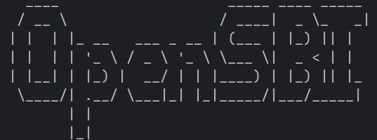

# Xv6-K210「Seccomp-lite」系统调用沙箱（QEMU）实验说明书


> 在不改动各个系统调用实现的前提下，只在 `syscall()` 分发点插一刀，就能让任意进程进入“最小权限模式”，把它能用的系统调用集合缩到你指定的白名单里

---

## 0. 状态盘点

已经完成并跑通了关键链路：

- `/etc/policy_*.txt` 已被打进镜像（能在 xv6 里 `ls /etc` 看到）。
- `/bin/sandbox` 命令可用（能用它跑 `cat README`、启动 `sh`）。
- 沙箱拒绝在 `syscall()` 统一生效：用 `policy_sh_noremove_trace.txt` 沙箱运行 `rm t`，配合 `strace` 看到了 `remove -> -1`，并且文件 `t` 仍存在，这正是“拒绝但不杀死”的预期行为。

这已经满足“功能完成 + 可验证 + 可讲故事”的课程验收标准。

---

## 1. 背景与动机

传统 xv6/教学 OS 里，一个用户程序拿到 shell，就等于拿到“全系统调用权限”。这对教学很方便，但对“安全/隔离”这条主线完全空白。

Linux 的 **seccomp** 思路非常直接：把进程一生用不到的系统调用关掉，减少攻击面（attack surface）。本项目把这个理念移植到你的 Xv6-K210 上，但做了“教学友好”的简化：

- 不做复杂 BPF 过滤（太重、学习门槛高）。
- 用 **bitmask 白名单** 表示允许的系统调用集合。
- 在 `syscall()` 分发点统一执法，成本低、效果立竿见影。

---

## 2. 想法来源

1) Linux seccomp / syscall filtering：提供“按进程过滤系统调用”的范式。  
2) MIT 6.S081 trace lab：trace 也是“在 syscall 返回前统一插桩”，并且强调
“对调用者及其 fork 的子进程生效”。这给了非常成熟的“按进程继承”的课程语境。

实现实际上是：**trace 的插桩位置 + seccomp 的安全目标** 的组合拳。

---

## 3. 原理速通：为什么拦截点选在 `syscall()`

在 RISC-V 的 xv6 中，用户态发起系统调用的典型路径是：

- 用户态 syscall stub 把 **系统调用号放进 a7**，然后执行 `ecall`；内核在 trap
处理里最终进入 `syscall()`。
- `syscall()` 从 trapframe 里拿到系统调用号，查表 `syscalls[num]` 调到具体的
`sys_xxx`，并把返回值写回 a0。

所以：  
**只要在 `syscall()` 查表之前做一次检查**，就能“对所有系统调用一刀切”，避免逐个修改
`sys_open/sys_read/...`，这是教学项目里最稳、最省心的策略。

---

## 4. 设计目标

- 默认不影响现有行为：沙箱默认关闭，只在用户调用 `sandbox()` 后生效。
- 按进程生效 + 可继承：fork 继承策略，让“沙箱 shell”能把限制传播给其启动的所有命令。
- 拒绝动作可扩展：当前先实现 `deny(-1)`，预留 kill/信号等动作（可作为后续加分点）。
- 策略可从文件加载：策略文件放 `/etc`，演示“现代 OS 的配置管理”味道更浓。

---

## 5. 具体设计

### 5.1 策略表示：`allow_mask[4]`（128-bit 白名单）

- 每个 bit 对应一个 syscall number（例如 `num=17`，落在 `word=0` 的第 17 位）。
- 128 位足够覆盖当前的 syscall 号表（你新增到了 42），并为未来扩展留余量。

进程结构体新增字段：

- `sandbox_on`：是否开启  
- `sandbox_action`：违例动作（目前 0 = deny(-1)）  
- `allow_mask[4]`：白名单

### 5.2 新系统调用：`sandbox(on, action, allow_mask, words)`

`sys_sandbox()` 行为：

- `on==0`：关闭沙箱并返回 0  
- `action`：当前仅允许 0（返回 -1 模式），其它值返回 -1（预留未来扩展）  
- `words` ∈ [0,4]：从用户态拷贝 `words * 4` 字节到内核临时数组，再写进
`p->allow_mask[]`，最后启用沙箱  

### 5.3 执法点：`kernel/syscall.c` 的统一“拒绝门”

核心策略：**在调用具体 sys_xxx 前先检查 allowlist**。

- 若 `sandbox_on` 开启，且当前 syscall 不是 `SYS_sandbox`：检查 bit  
- 不允许：直接把返回值写成 `-1`（相当于 errno 模式），并可复用 trace 的输出风格
（如果 trace mask 开着）

### 5.4 生命周期处理：初始化 / 继承 / 清理

- `allocproc()` 默认关闭沙箱，并清零 allow_mask  
- `fork()` 继承沙箱字段  
- `freeproc()` 清理沙箱字段

---

## 6. 构建系统与文件布局

### 6.1 新增用户态命令

Makefile 把 `_sandbox` 加入 `UPROGS`，让它进入镜像成为 `/bin/sandbox`
（或出现在根目录命令列表中）。

### 6.2 策略文件打包进镜像 `/etc`

Makefile 的 `fs` 规则里创建 `/etc` 并复制 `etc/policy*.txt` 到镜像。

---

## 7. 环境配置（WSL + QEMU）

### 7.1 必须在 WSL 里编译

你在 PowerShell 里 `make` 报 `riscv64-unknown-elf-gcc: No such file or
 directory`，说明 Windows 环境没有 RISC-V 交叉编译器。

结论：**只在 WSL 里编译运行**，PowerShell 仅用于进入目录/调用 `wsl`。

### 7.2 WSL 里安装常用依赖（示例）

```bash
sudo apt update
sudo apt install -y build-essential qemu-system-misc dosfstools mtools
dos2unix
```

---

## 8. 常用命令速查（WSL and xv6）

### 8.1 在 WSL（宿主机）常用

- `make clean`：清理旧编译产物  
- `make fs`：生成文件系统镜像 `fs.img`  
- `make run`：启动 QEMU 跑 xv6  

文件操作：

- `ls`：列目录  
- `cat file`：查看文件内容  
- `mkdir dir`：创建目录  
- `rm file`：删除文件  
- `grep -n "xxx" file`：在源码里搜索（只能在 WSL 源码目录里用）

### 8.2 在 xv6（客体系统）常用

- `ls`：列当前目录  
- `cat README`：读文件  
- `mkdir t`：创建目录 `t`  
- `rm t`：删除  
- `/bin/sandbox ...`：以沙箱策略运行一个命令或 shell  

---

## 9. 实验验证操作

### 9.0 验证标准

- 允许的 syscall：程序正常工作  
- 不允许的 syscall：程序失败，但内核不崩溃；返回值是 `-1`，用户程序会打印错误  
- 可观测性：用 `strace` 看到被拒绝的 syscall 与返回值

---

### 9.1 基线：不开沙箱，cat README 能成功

在 xv6 shell：

```sh
cat README
```

预期：打印 README 内容。


---

### 9.2 deny open：用 policy_nofile 限制 cat（应失败）

```sh
/bin/sandbox /etc/policy_nofile.txt cat README
```

预期：`cat` 需要 `open`，被拒绝后报错，不会打印 README 正文。


---

### 9.3 deny remove：沙箱 shell 里禁止 rm

1) 进入沙箱 shell：

```sh
/bin/sandbox -e /etc/policy_sh_noremove_trace.txt sh
```

2) 在这个 shell 里创建目录并尝试删除：

```sh
mkdir t
rm t
```

预期：`mkdir` 成功，`rm` 失败（例如 `failed to delete`），且 `ls` 还能看到 `t`
仍在。


---

### 9.4 让现象更“硬核”：用 strace 看到 `remove -> -1`

先在 WSL 确认 `SYS_remove` 的号：

```bash
grep -n "SYS_remove" kernel/include/sysnum.h
```

已经查到是 17，所以 mask = `1 << 17` = 131072。

在沙箱 shell 里执行：

```sh
/bin/strace 131072 rm t
```

预期输出包含：

- `pid X: remove -> -1`


---

## 10. 遇到的错误以及原因

### 10.1 “unknown syscall 'unlink' (ignored)” 是什么？

xv6 不一定叫 `unlink`，可能叫 `remove`。策略文件写了不存在的名字，会被忽略。

解决：以 `kernel/include/sysnum.h` 为准写策略（在 WSL 上 grep）。

### 10.2 策略文件出现乱码（“��#”）

这是 Windows 文本编码/换行坑：CRLF、UTF-8 BOM 会让解析器读到奇怪字符。  
解决：用 `dos2unix etc/policy_*.txt` 统一转换。

### 10.3 “sandbox: open /etc/xxx failed”

- 文件不在镜像里：回 WSL `make fs` 重建 `fs.img`  
- 文件名不匹配复制规则（建议命名 `policy_*.txt`）

---

## 11. 结果展示

- 30 秒：`sandbox policy_nofile cat README` → “没权限读文件”  
- 90 秒：sandboxed sh 内 `mkdir` 成功、`rm` 失败 → “最小权限 shell”  
- 3 分钟：加上 `strace` 输出 `remove -> -1` → “可观测、可调试、可验收”

---

## 12. 截图清单


1. WSL：`make fs` 成功生成 fs.img（终端截图）  

2. xv6：`ls /etc` 显示 policy 文件已打包  

3. Baseline：`cat README` 正常输出  

4. deny open：`sandbox policy_nofile cat README` 失败输出  

5. deny remove：sandboxed sh 内 `mkdir t` 成功、`rm t` 失败、`ls` 仍有 t 

6. strace 证据：`/bin/strace 131072 rm t` 输出 `remove -> -1`


---

## 13. 参考资料

```text
MIT 6.S081 System calls lab (trace): https://pdos.csail.mit.edu/6.S081/2020/labs/syscall.html
MIT 6.S081 syscall lecture slides: https://pdos.csail.mit.edu/6.S081/2020/slides/lec05.pdf
xv6-riscv repo README: https://github.com/mit-pdos/xv6-riscv
Linux kernel seccomp filter docs: https://www.kernel.org/doc/html/latest/userspace-api/seccomp_filter.html
dos2unix(1) man page: https://man.archlinux.org/man/dos2unix.1.en
mkfs.vfat(8) man page: https://www.man7.org/linux/man-pages/man8/mkfs.vfat.8.html
```

---

## 附：可直接复制的策略文件模板

### policy_cat.txt（最小可用 cat）

```txt
# minimal policy for cat
open
read
write
close
fstat
exit
```

### policy_sh_noremove_trace.txt（可交互 shell + 禁止 remove + 允许 trace）

```txt
fork
exec
wait
exit
pipe
read
write
close
open
fstat
dup
chdir
getpid
sbrk
sleep
uptime
getcwd
readdir
mkdir
rename
trace
```
