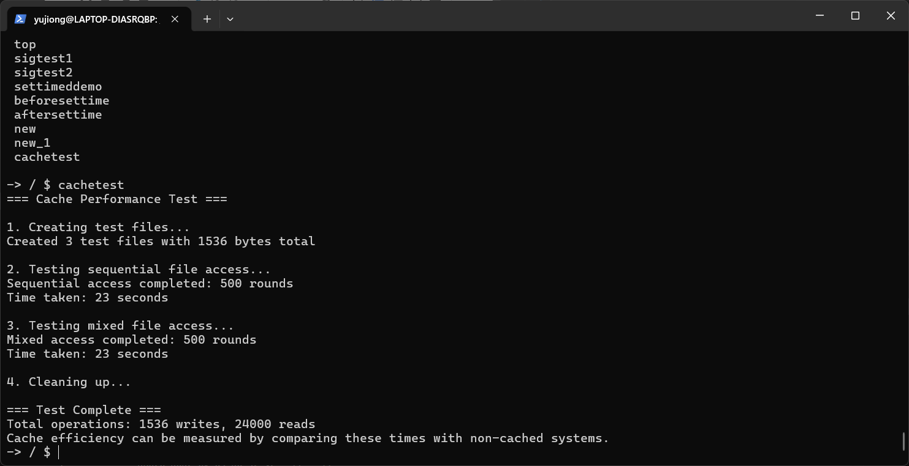

# Cachetest - xv6-k210 文件系统缓存性能测试工具

## 概述

cachetest是一个用于测试xv6-k210文件系统缓存性能的简单而有效的工具。它通过测量重复读取多个文件所需的时间，帮助用户评估文件系统缓存减少磁盘I/O操作的效果。

## 程序结构

### 文件名

- 源代码: `cachetest.c`
- 可执行文件: `cachetest`
- 文档: `cachetest.md`

### 编译方式

自动编译（构建文件系统时）:

```bash

makefs

```

手动编译（如需）:

```bash

riscv64-unknown-elf-gcc-Wall-O-fno-omit-frame-pointer-ggdb-g-MD-mcmodel=medany-ffreestanding-fno-common-nostdlib-mno-relax-I.-fno-stack-protector-DQEMU-c-oxv6-user/cachetest.oxv6-user/cachetest.c

riscv64-unknown-elf-ld-zmax-page-size=4096-N-emain-Ttext0-oxv6-user/_cachetestxv6-user/cachetest.oxv6-user/ulib.oxv6-user/usys.oxv6-user/printf.oxv6-user/umalloc.o

```

## 使用方法

### 命令格式

```

cachetest

```

cachetest无需任何命令行参数。

### 执行步骤

运行 `cachetest`时，它会自动执行以下操作：

1.**创建测试文件**: 创建3个测试文件(`test1.txt`, `test2.txt`, `test3.txt`)，每个文件512字节。

2.**顺序访问测试**: 按顺序(test1.txt → test2.txt → test3.txt)读取3个测试文件500次。

3.**混合访问测试**: 按交替顺序(test1.txt → test3.txt → test2.txt)读取3个测试文件500次，模拟随机访问模式。

4.**清理**: 测试完成后清理测试文件。

5.**结果报告**: 显示两种访问模式的耗时和总操作数。

## 输出结果解读

### 示例输出

```

=== Cache Performance Test ===


1. Creating test files...

Created 3 test files with 1536 bytes total


2. Testing sequential file access...

Sequential access completed: 500 rounds

Time taken: 2 seconds


3. Testing mixed file access...

Mixed access completed: 500 rounds

Time taken: 3 seconds


4. Cleaning up...


=== Test Complete ===

Total operations: 1536 writes, 1536000 reads

Cache efficiency can be measured by comparing these times with non-cached systems.

```

### 关键指标

-**顺序访问时间**: 按顺序读取文件所需的时间

-**混合访问时间**: 非顺序读取文件所需的时间

-**总操作数**: 执行的写入和读取操作总数

### 结果分析



-**有缓存系统**: 混合访问应该只比顺序访问慢一点

-**无缓存系统**: 混合访问应该比顺序访问慢很多，因为磁盘I/O增加

-**缓存效果**: 缓存系统和无缓存系统之间的时间差越大，缓存实现的效果越好

## 配置选项

可以通过修改 `cachetest.c`中的以下常量来定制cachetest程序：

| 常量 | 默认值 | 描述 |
|----------|---------|-------------|
| `TEST_FILES` | 3 | 要创建和读取的测试文件数量 |
| `TEST_READS` | 500 | 每个文件在每次测试中读取的次数 |
| 缓冲区大小 | 64 bytes | 读取缓冲区的大小 (第16行) |
| 文件大小 | 512 bytes | 每个测试文件的大小 (第34行, `j < 512`) |

### 修改示例

```c

// 增加测试强度

#define TEST_FILES 5    // 使用5个文件而不是3个

#define TEST_READS 1000  // 每个文件读取1000次而不是500次

```

## 性能考虑

-**文件系统大小**: 确保测试文件能放入缓存，以获得有意义的结果

-**系统负载**: 在系统空闲时运行cachetest以获得准确的测量结果

-**测试时长**: 增加 `TEST_READS`以进行更长时间的测试，减少时间分辨率误差

-**一致性**: 比较时始终使用完全相同的配置

## 局限性

- 使用xv6的 `uptime()`函数，该函数仅返回秒级分辨率
- 不支持命令行参数
- 只测量读取性能，不测量写入性能
- 混合访问模式只是简单的交替，不是真正的随机访问

## 相关文件

-`/home/lwl/xv6-k210/kernel/fat32.c` - 带有缓存的FAT32文件系统实现

-`/home/lwl/xv6-k210/kernel/include/fat32.h` - 缓存常量和结构

## 故障排除

### 错误: "Cannot create testN.txt"

- 检查文件系统可用空间
- 确保没有同名文件存在

### 错误: "Cannot open testN.txt"

- 验证测试文件是否成功创建
- 检查文件系统是否正常工作

### 无输出或执行时间过长

- 确保xv6的定时器正常工作
- 验证 `uptime()`系统调用是否正常工作
- 考虑增加文件系统镜像的大小
