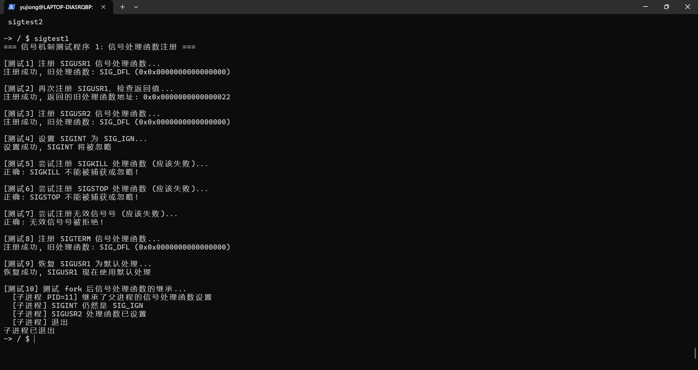

# 信号机制 - 第一阶段：信号处理函数注册

信号是 Unix/Linux 系统中进程间通信和异常处理的重要机制。本项目第一阶段实现了信号处理函数的注册功能，为后续的信号发送和处理奠定基础。

## 设计思路

参考 POSIX 标准的信号接口风格，提供以下核心功能：

1. **信号类型定义**：定义了常用的 POSIX 信号类型（SIGINT、SIGTERM、SIGKILL、SIGSTOP 等）
2. **信号处理函数注册**：通过 `signal()` 系统调用注册自定义信号处理函数
3. **特殊信号保护**：SIGKILL 和 SIGSTOP 不能被捕获或忽略
4. **进程信号状态维护**：在每个进程结构中维护信号处理函数数组

### 数据结构

在 `struct proc` 中添加了信号相关字段：

```c
struct proc {
  // ... 其他字段 ...

  // Signal handling
  uint64 sig_pending;          // Pending signals bitmap (bit 0 = signal 1, etc.)
  uint64 sig_handlers[NSIG];   // Signal handler addresses
  uint64 sig_mask;             // Signal mask (blocked signals)
};
```

使用位图表示待处理信号，数组存储每个信号的处理函数地址。

## 具体实现

### 1. 信号类型定义 ([kernel/include/signal.h](kernel/include/signal.h))

新增加的信号头文件定义了所有支持的信号类型和特殊常量：

```c
#define SIGHUP    1   // Hangup detected on controlling terminal
#define SIGINT    2   // Interrupt from keyboard
#define SIGTERM   15  // Termination signal
#define SIGKILL   9   // Kill signal (cannot be caught)
#define SIGSTOP   19  // Stop process (cannot be caught)
#define SIGCONT   18  // Continue if stopped
// ... 更多信号类型

#define SIG_DFL  ((void (*)(int))0)   // Default signal handling
#define SIG_IGN  ((void (*)(int))1)   // Ignore signal
#define SIG_ERR  ((void (*)(int))(-1))// Signal error return value
```

### 2. 系统调用实现 ([kernel/sysproc.c](kernel/sysproc.c))

**sys_signal()** - 注册信号处理函数：

```c
uint64 sys_signal(void)
{
  int sig;
  uint64 handler_addr;
  struct proc *p = myproc();

  // 获取参数
  if(argint(0, &sig) < 0)
    return (uint64)SIG_ERR;
  if(argaddr(1, &handler_addr) < 0)
    return (uint64)SIG_ERR;

  // 验证信号号
  if(sig < 1 || sig >= NSIG)
    return (uint64)SIG_ERR;

  // SIGKILL 和 SIGSTOP 不能被捕获
  if(sig == SIGKILL || sig == SIGSTOP)
    return (uint64)SIG_ERR;

  acquire(&p->lock);

  // 保存旧处理函数并设置新处理函数
  uint64 old_handler = p->sig_handlers[sig];
  p->sig_handlers[sig] = handler_addr;

  release(&p->lock);

  return old_handler;
}
```

**sys_sigkill()** - 发送信号到进程：

```c
uint64 sys_sigkill(void)
{
  int pid, sig;
  struct proc *p;

  // 获取参数
  if(argint(0, &pid) < 0)
    return -1;
  if(argint(1, &sig) < 0)
    return -1;

  // 验证信号号
  if(sig < 1 || sig >= NSIG)
    return -1;

  // 查找目标进程
  for(p = proc; p < &proc[NPROC]; p++){
    acquire(&p->lock);
    if(p->pid == pid){
      // 设置待处理信号位
      p->sig_pending |= (1UL << (sig - 1));

      // 唤醒睡眠中的进程
      if(p->state == SLEEPING){
        p->state = RUNNABLE;
      }
      release(&p->lock);
      return 0;
    }
    release(&p->lock);
  }
  return -1;
}
```

### 3. 进程初始化 ([kernel/proc.c](kernel/proc.c))

在 `allocproc()` 中初始化信号相关字段：

```c
// Initialize signal handling
p->sig_pending = 0;     // No pending signals
p->sig_mask = 0;        // No signals blocked
// Set default handlers for all signals
for(int i = 0; i < NSIG; i++) {
  p->sig_handlers[i] = (uint64)SIG_DFL;
}
```

在 `freeproc()` 中清理信号相关字段，确保进程结构被正确重置。

### 4. 用户空间接口

在 [xv6-user/user.h](xv6-user/user.h) 中添加了用户态函数声明：

```c
// Signal system calls
void (*signal(int sig, void (*handler)(int)))(int);
int sigkill(int pid, int sig);
```

在 [xv6-user/usys.S](xv6-user/usys.S) 中添加了系统调用存根。

## 遇到的问题

### 坑1：fork 后信号处理函数的继承

按照 Unix 语义，fork 之后子进程应该继承父进程的信号处理函数设置。当前实现中，由于 `fork()` 会复制整个 `struct proc`（包括 `sig_handlers` 数组），子进程自然继承了父进程的信号处理函数设置，这是符合预期的。

测试程序 `sigtest1.c` 验证了这一点：父进程注册了 SIGINT 和 SIGUSR2 的处理函数后，子进程可以看到这些设置。

### 坑2：SIGKILL 和 SIGSTOP 的特殊处理

SIGKILL 和 SIGSTOP 是两个不能被捕获或忽略的特殊信号。这是 Unix 系统的基本安全机制，确保系统管理员总是可以终止进程。

在 `sys_signal()` 中添加了检查：

```c
if(sig == SIGKILL || sig == SIGSTOP)
  return (uint64)SIG_ERR;
```

这样可以防止用户程序试图覆盖这两个信号的处理行为。

### 坑3：信号处理函数指针的类型

`signal()` 的函数签名有点复杂：

```c
void (*signal(int sig, void (*handler)(int)))(int);
```

这是正确的 POSIX 声明，表示 `signal` 返回一个指向"接收 int 参数无返回值的函数"的指针。在用户态使用时可以简化为：

```c
void (*old_handler)(int);
old_handler = signal(SIGUSR1, my_handler);
```

## 测试结果

测试程序 [xv6-user/sigtest1.c](xv6-user/sigtest1.c) 包含了 10 个测试用例：

1. 注册 SIGUSR1 信号处理函数
2. 再次注册同一信号，验证返回值
3. 注册 SIGUSR2 信号处理函数
4. 设置 SIGINT 为 SIG_IGN（忽略）
5. 尝试注册 SIGKILL（应该失败）
6. 尝试注册 SIGSTOP（应该失败）
7. 尝试注册无效信号号（应该失败）
8. 注册 SIGTERM 信号处理函数
9. 恢复 SIGUSR1 为默认处理
10. 测试 fork 后信号处理函数的继承

所有测试都验证了信号处理函数注册的正确性。



## 修改的文件

- **新增** [kernel/include/signal.h](kernel/include/signal.h) - 信号类型和常量定义
- [kernel/include/proc.h](kernel/include/proc.h) - 在进程结构中添加信号字段
- [kernel/proc.c](kernel/proc.c) - 初始化和清理信号相关字段
- [kernel/include/sysnum.h](kernel/include/sysnum.h) - 添加系统调用号 37-38
- [kernel/syscall.c](kernel/syscall.c) - 注册系统调用
- [kernel/sysproc.c](kernel/sysproc.c) - 实现系统调用
- [xv6-user/user.h](xv6-user/user.h) - 用户态函数声明
- [xv6-user/usys.S](xv6-user/usys.S) - 添加系统调用存根
- [Makefile](Makefile) - 添加 _sigtest1 到编译列表
- **新增** [xv6-user/sigtest1.c](xv6-user/sigtest1.c) - 测试程序

## 下一步计划

第一阶段完成了信号处理函数的注册。后续阶段将实现：

1. **信号处理机制**：在 trap 处理中检测待处理信号，调用用户定义的处理函数
2. **默认信号处理**：实现 SIGKILL（强制终止）、SIGSTOP（暂停）、SIGCONT（继续）的默认行为
3. **信号掩码**：实现 `sigprocmask()` 来阻塞/解除阻塞信号
4. **信号发送测试**：完善测试程序，验证完整的信号发送和处理流程

目前信号发送系统调用 `sys_sigkill()` 已经实现，但信号的真正处理还需要在 trap.c 中的 `usertrap()` 函数里添加处理逻辑。这将在下一阶段完成。
