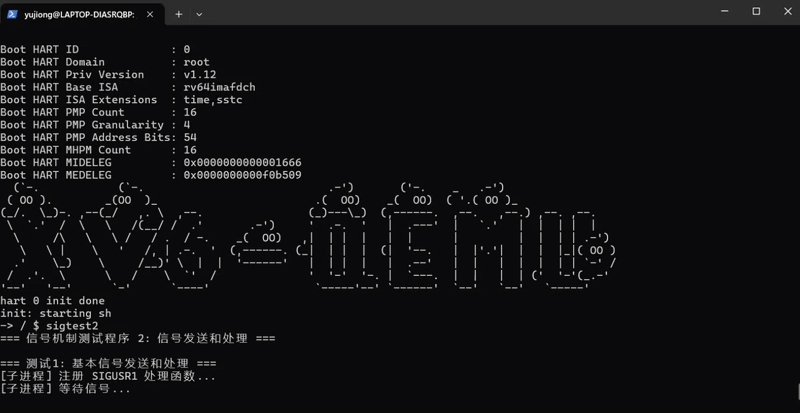

# 信号机制 - 第二阶段：信号传递和处理

第一阶段实现了信号处理函数的注册功能。本阶段实现了完整的信号传递和处理机制，使得信号能够真正从发送方传递到接收方，并触发相应的处理动作。

## 设计思路

信号传递和处理的核心是在进程从内核返回用户空间之前（usertrapret），检查并处理待处理的信号。具体步骤：

1. **信号发送**：`sys_sigkill()` 系统调用设置目标进程的 `sig_pending` 位图
2. **信号检测**：在 `usertrap()` 中调用 `process_signals()` 检查待处理信号
3. **信号分发**：根据信号类型和处理函数执行相应的动作：
   - SIGKILL: 设置 `p->killed = 1`，进程将在下次 trap 时终止
   - SIGSTOP: 将进程状态设置为 SLEEPING
   - SIGCONT: 将暂停的进程恢复为 RUNNABLE
   - SIG_IGN: 忽略信号，清除待处理位
   - SIG_DFL: 执行默认操作（大多数信号终止进程）
   - 用户处理函数: 修改 trapframe 跳转到处理函数

### 数据结构扩展

在第一阶段的基础上，本阶段在 `struct trapframe` 中添加了新字段：

```c
struct trapframe {
  // ... 原有字段 ...
  /* 288 */ uint64 signal_ret_pc;  // 信号处理函数返回后的恢复地址
};
```

`signal_ret_pc` 用于保存信号处理前的用户 PC，当信号处理函数返回时，恢复到这个地址继续执行。

## 具体实现

### 1. trap.c 中的信号处理函数 ([kernel/trap.c](kernel/trap.c))

**process_signals()** - 处理待处理信号：

```c
int process_signals(void)
{
  struct proc *p = myproc();
  if (p == 0) return 0;

  acquire(&p->lock);

  // 检查是否有未被阻塞的待处理信号
  uint64 pending = p->sig_pending & ~p->sig_mask;
  if (pending == 0) {
    release(&p->lock);
    return 0;
  }

  // 找到第一个待处理信号（优先级最低的位）
  int sig = 0;
  for (int i = 0; i < NSIG; i++) {
    if (pending & (1UL << i)) {
      sig = i + 1;
      break;
    }
  }

  // 清除待处理位
  p->sig_pending &= ~(1UL << (sig - 1));
  release(&p->lock);

  // 处理特殊信号
  if (sig == SIGKILL) {
    p->killed = 1;
    return 1;
  }

  if (sig == SIGSTOP) {
    // 暂停进程
    acquire(&p->lock);
    if (p->state == RUNNING) {
      p->state = SLEEPING;
      p->chan = (void*)1;  // 标记为信号暂停
    }
    release(&p->lock);
    return 1;
  }

  if (sig == SIGCONT) {
    // 继续进程
    acquire(&p->lock);
    if (p->state == SLEEPING && p->chan == (void*)1) {
      p->state = RUNNABLE;
      p->chan = 0;
    }
    release(&p->lock);
    return 1;
  }

  // 获取处理函数
  uint64 handler = p->sig_handlers[sig];

  if (handler == (uint64)SIG_IGN) {
    return 1;  // 忽略
  }

  if (handler == (uint64)SIG_DFL) {
    // 默认处理
    if (sig == SIGCHLD || sig == SIGCONT || sig == SIGWINCH) {
      return 1;  // 这些信号默认忽略
    }
    p->killed = 1;  // 其他信号默认终止
    return 1;
  }

  // 用户定义的处理函数
  if (p->trapframe->signal_ret_pc == 0) {
    p->trapframe->signal_ret_pc = p->trapframe->epc;
    p->trapframe->epc = handler;
    p->trapframe->a0 = sig;  // 信号编号作为参数
  }

  return 1;
}
```

### 2. usertrap() 中的修改

在 `usertrap()` 函数开始时添加了信号返回恢复逻辑：

```c
void usertrap(void)
{
  // ...
  struct proc *p = myproc();

  // 保存用户 PC
  p->trapframe->epc = r_sepc();

  // 检查是否从信号处理函数返回
  if (p->trapframe->signal_ret_pc != 0) {
    p->trapframe->epc = p->trapframe->signal_ret_pc;
    p->trapframe->signal_ret_pc = 0;
  }

  // ... 其余 trap 处理 ...

  // 在返回用户空间前处理信号
  process_signals();

  // ...
}
```

### 3. trampoline.S 的修改

在 uservec 中保存新的 `signal_ret_pc` 字段：

```asm
sd t6, 280(a0)
sd t1, 288(a0)  # save signal_ret_pc (use t1 as temp)
```

在 userret 中，该字段不由用户态直接恢复，而是由内核管理。

## 遇到的问题

### 坑1：信号处理函数的返回机制

**问题**：信号处理函数调用后，如何返回到原来的执行点？

**解决方案**：使用 `signal_ret_pc` 字段保存原始 PC。当信号处理函数执行完毕后，下一次进入内核 trap 时，检查 `signal_ret_pc` 是否非零，如果是则恢复原始 PC 并清零该字段。

这个方法的限制是每次只能处理一个信号（signal_ret_pc 非零时不会嵌套调用其他信号处理函数），这对于简单的信号机制是可接受的。

### 坑2：SIGSTOP/SIGCONT 的状态管理

**问题**：如何区分"因信号而暂停"和"因等待资源而睡眠"？

**解决方案**：使用 `p->chan` 字段作为标记。当进程因 SIGSTOP 暂停时，设置 `p->chan = (void*)1`；SIGCONT 时检查 `p->chan == (void*)1` 才恢复。这样可以避免误唤醒正常的睡眠进程。

### 坑3：信号处理的调用时机

**问题**：在 `usertrap()` 的哪个位置调用 `process_signals()`？

**解决方案**：在 `killed` 检查之后、`usertrapret()` 之前调用。这样可以确保：

- 如果进程被标记为 killed，会先退出
- 信号处理会在返回用户空间之前完成
- 不会干扰正常的 trap 处理流程（系统调用、页面错误等）

## 测试结果

测试程序 [xv6-user/sigtest2.c](xv6-user/sigtest2.c) 包含 5 个测试用例：

1. **基本信号发送和处理**：父进程发送 SIGUSR1 给子进程，验证处理函数被调用
2. **SIGKILL 信号**：发送 SIGKILL 终止子进程
3. **SIGSTOP 和 SIGCONT**：暂停并继续子进程
4. **多个信号排队**：连续发送多个信号，验证都能被处理
5. **SIG_IGN 忽略信号**：设置信号为忽略状态

   

## 修改的文件

- [kernel/include/trap.h](kernel/include/trap.h) - 在 trapframe 中添加 signal_ret_pc 字段
- [kernel/trampoline.S](kernel/trampoline.S) - 保存/恢复 signal_ret_pc
- [kernel/trap.c](kernel/trap.c) - 实现 process_signals()，在 usertrap() 中调用
- [kernel/include/signal.h](kernel/include/signal.h) - 添加 SIGCHLD 和 SIGWINCH 定义
- [xv6-user/sigtest2.c](xv6-user/sigtest2.c) - 测试程序
- [Makefile](Makefile) - 添加 _sigtest2 到编译列表

## 当前限制

1. **不支持信号嵌套**：当一个信号处理函数正在执行时，其他信号不会立即处理
2. **没有信号掩码**：`sig_mask` 字段已经定义，但 `sigprocmask()` 系统调用尚未实现
3. **简化的返回机制**：信号处理函数返回时直接跳回到被中断的点，没有复杂的栈帧管理

## 下一步计划

第三阶段将实现信号掩码（signal mask）机制：

1. 实现 `sys_sigprocmask()` 系统调用
2. 允许进程阻塞/解除阻塞特定信号
3. 在信号处理期间自动阻塞同类信号

第四阶段可以扩展更多功能：

- `sigaction()` 系统调用（更灵活的信号处理）
- 信号队列（同一信号的多次发送）
- 实时信号支持
