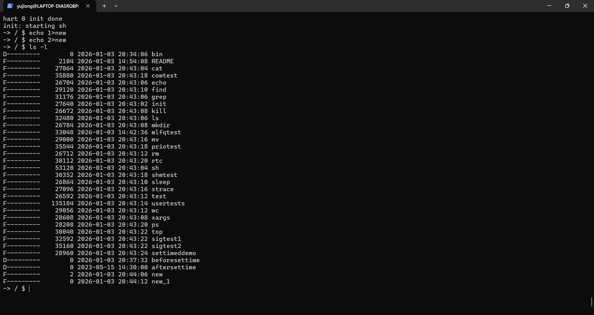

# 文件名排重机制

## 1. 背景

原xv6-k210文件系统在遇到同名文件时会直接返回错误，不允许创建同名文件。这与标准FAT32文件系统的行为不一致，标准FAT32系统会在遇到同名文件时自动生成带有数字后缀的短文件名（如FILE~1.TXT）。

## 2. 实现方案

在文件系统的 `ealloc` 函数中添加了文件名排重逻辑，当检测到同名文件存在时，自动生成带有数字后缀的唯一文件名。

## 3. 排重规则

-**后缀格式**：使用 `_` 作为分隔符，后跟数字（如 FILE_1.TXT）

-**数字范围**：支持 1-9999 的数字后缀

-**文件类型支持**：同时支持普通文件和目录

-**长文件名保留**：完整的长文件名会被保留，排重逻辑仅影响短文件名的生成

-**边界处理**：若文件名过长，会自动截断以适应FAT32_MAX_FILENAME限制

## 4. 实现代码

```c

// 在 ealloc 函数中，当文件/目录存在时：


// 尝试创建文件名_1, 文件名_2, ..., 文件名_9999

for (i = 1; i <= 9999; i++) {

    // 手动将数字转换为字符串，避免系统库依赖

    charnum_str[10];

    int num_len = 0;

    int temp_num = i;


    num_str[num_len++] = '_';  // 使用 _ 作为分隔符


    charreverse_num[10];

    int rev_len = 0;


    // 将数字转换为字符串

    do {

        reverse_num[rev_len++] = '0' + (temp_num % 10);

        temp_num /= 10;

    } while (temp_num > 0);


    // 反转得到正确的数字字符串

    for (int j = rev_len - 1; j >= 0; j--) {

        num_str[num_len++] = reverse_num[j];

    }

    num_str[num_len] = '\0';


    // 手动拼接文件名和数字后缀

    int name_len = strlen(name);

    int num_str_len = strlen(num_str);


    int total_len = name_len + num_str_len;

    if (total_len > FAT32_MAX_FILENAME) {

        name_len = FAT32_MAX_FILENAME - num_str_len;

    }


    // 复制基础文件名

    for (int j = 0; j < name_len; j++) {

        unique_name[j] = name[j];

    }


    // 追加数字后缀

    for (int j = 0; j < num_str_len && (name_len + j) < FAT32_MAX_FILENAME; j++) {

        unique_name[name_len + j] = num_str[j];

    }


    // 确保字符串以 null 结尾

    int final_len = (total_len < FAT32_MAX_FILENAME) ? total_len : FAT32_MAX_FILENAME;

    unique_name[final_len] = '\0';


    // 检查生成的唯一文件名是否存在

    if (dirlookup(dp, unique_name, &off) == NULL) {

        break;  // 找到唯一文件名

    }

}

```

## 5. 使用示例

- 当创建一个已存在的文件 `file.txt` 时，会自动生成 `file_1.txt`
- 再次创建同名文件时，会生成 `file_2.txt`，依此类推
- 最多支持生成 9999 个同名文件

## 6. 兼容性

- 与原系统完全向后兼容，若文件名不存在则使用原始文件名
- 保持了原有的目录项查找和文件创建流程
- 不依赖任何系统库函数，确保在嵌入式环境中的可用性

## 7. 注意事项

- 文件名排重仅在同一目录下生效
- 目录名也会应用同样的排重规则
- 数字后缀会自动递增，直到找到可用的文件名
- 如果超过9999个同名文件，会返回创建失败

## 8. 测试结果

创建两个new文件，文件名排重机制自动将第二个new文件加上后缀_1