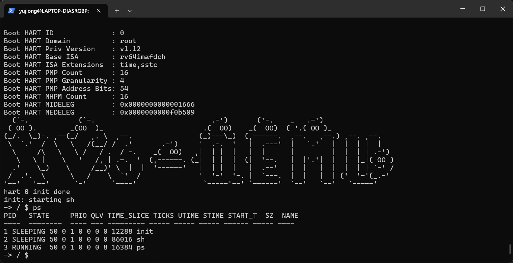
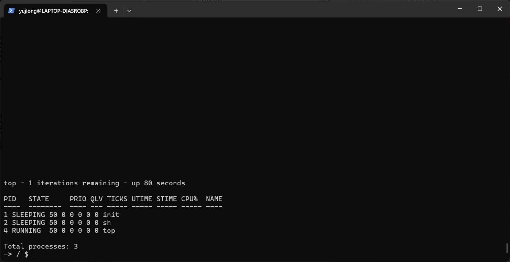

# 进程信息与统计

## 概述

本功能为 xv6 操作系统添加了进程信息查询和统计功能，包括：

1. **ps 命令** - 列出所有进程的状态信息
2. **top 命令** - 实时显示进程状态
3. **进程时间统计** - 用户态/内核态时间统计

这些功能通过两个新的系统调用实现：

- `sys_getprocs()` - 获取进程信息数组
- `sys_getrusage()` - 获取当前进程的资源使用情况

## 实现细节

### 1. 进程时间统计字段

在 [kernel/include/proc.h](kernel/include/proc.h) 的 `struct proc` 中添加了以下字段：

```c
// Process time statistics
uint64 utime;                // User mode ticks
uint64 stime;                // Kernel mode ticks
uint64 start_time;           // Process start time (ticks since boot)
```

- `utime`: 进程在用户态执行的时钟 tick 数
- `stime`: 进程在内核态执行的时钟 tick 数
- `start_time`: 进程启动时的系统 tick 数

### 2. 时间统计更新机制

在 [kernel/trap.c](kernel/trap.c) 的中断处理中更新时间统计：

**用户态时钟中断 (usertrap)**:

```c
if(which_dev == 2) {
  // Update user mode time statistics
  if(p != 0) {
    acquire(&p->lock);
    p->utime++;
    release(&p->lock);
  }
  ...
}
```

**内核态时钟中断 (kerneltrap)**:

```c
if(which_dev == 2 && myproc() != 0 && myproc()->state == RUNNING) {
  // Update kernel mode time statistics
  struct proc *p = myproc();
  acquire(&p->lock);
  p->stime++;
  release(&p->lock);
  ...
}
```

### 3. 进程信息结构体

创建了 [kernel/include/procinfo.h](kernel/include/procinfo.h) 定义进程信息结构体：

```c
struct procinfo {
  int pid;              // Process ID
  int state;            // Process state (UNUSED, SLEEPING, RUNNABLE, RUNNING, ZOMBIE)
  int priority;         // Process priority (0-100)
  int queue_level;      // MLFQ queue level (0=highest, 2=lowest)
  int time_slice;       // Remaining time slices
  uint64 ticks_used;    // Total ticks used
  uint64 utime;         // User mode ticks
  uint64 stime;         // Kernel mode ticks
  uint64 start_time;    // Process start time (ticks since boot)
  uint64 sz;            // Process memory size (bytes)
  char name[16];        // Process name
};
```

### 4. 系统调用实现

#### sys_getprocs()

在 [kernel/sysproc.c](kernel/sysproc.c) 中实现：

```c
uint64 sys_getprocs(void)
{
  uint64 addr;
  int max_count;

  if(argaddr(0, &addr) < 0)
    return -1;
  if(argint(1, &max_count) < 0)
    return -1;

  struct proc *p;
  int count = 0;
  struct procinfo info;

  // Iterate through all processes
  for(p = proc; p < &proc[NPROC]; p++) {
    if(count >= max_count)
      break;

    acquire(&p->lock);

    // Only include non-UNUSED processes
    if(p->state != UNUSED) {
      // Fill in procinfo structure
      ...
      // Copy to user space
      if(copyout2(addr + count * sizeof(info), (char*)&info, sizeof(info)) < 0) {
        return -1;
      }
      count++;
    }
    release(&p->lock);
  }

  return count;
}
```

**参数**:

- `addr`: 用户空间缓冲区地址
- `max_count`: 最大进程数

**返回值**: 实际复制的进程数量，或 -1 表示错误

#### sys_getrusage()

在 [kernel/sysproc.c](kernel/sysproc.c) 中实现：

```c
uint64 sys_getrusage(void)
{
  uint64 utime_addr, stime_addr;
  struct proc *p = myproc();

  if(argaddr(0, &utime_addr) < 0)
    return -1;
  if(argaddr(1, &stime_addr) < 0)
    return -1;

  acquire(&p->lock);

  // Copy utime and stime to user space
  if(utime_addr != 0 && copyout2(utime_addr, (char*)&p->utime, sizeof(p->utime)) < 0) {
    release(&p->lock);
    return -1;
  }

  if(stime_addr != 0 && copyout2(stime_addr, (char*)&p->stime, sizeof(p->stime)) < 0) {
    release(&p->lock);
    return -1;
  }

  release(&p->lock);
  return 0;
}
```

**参数**:

- `utime_addr`: 存储用户态时间的地址（可为 NULL）
- `stime_addr`: 存储内核态时间的地址（可为 NULL）

**返回值**: 0 表示成功，-1 表示错误

### 5. 系统调用注册

在 [kernel/include/sysnum.h](kernel/include/sysnum.h) 中添加系统调用号：

```c
#define SYS_getprocs      35  // Get process information array
#define SYS_getrusage    36  // Get resource usage
```

在 [kernel/syscall.c](kernel/syscall.c) 中注册：

```c
extern uint64 sys_getprocs(void);
extern uint64 sys_getrusage(void);

static uint64 (*syscalls[])(void) = {
  ...
  [SYS_getprocs]      sys_getprocs,
  [SYS_getrusage]    sys_getrusage,
};

static char *sysnames[] = {
  ...
  [SYS_getprocs]      "getprocs",
  [SYS_getrusage]    "getrusage",
};
```

在 [xv6-user/usys.pl](xv6-user/usys.pl) 中添加用户态入口：

```perl
entry("getprocs");
entry("getrusage");
```

在 [xv6-user/user.h](xv6-user/user.h) 中添加声明：

```c
struct procinfo;
int getprocs(struct procinfo *info, int max_count);
int getrusage(uint64 *utime, uint64 *stime);
```

## 测试程序

### ps 命令

文件：[xv6-user/ps.c](xv6-user/ps.c)

功能：列出所有进程的详细信息

输出结果：



### top 命令

文件：[xv6-user/top.c](xv6-user/top.c)

功能：实时显示进程状态（每秒刷新）

输出结果：



使用方法：

```sh
$ top          # 默认运行10次
$ top 5        # 运行5次
```

## 修改的文件清单

| 文件                                                | 说明                     |
| --------------------------------------------------- | ------------------------ |
| [kernel/include/proc.h](kernel/include/proc.h)         | 添加时间统计字段         |
| [kernel/include/procinfo.h](kernel/include/procinfo.h) | 新建：进程信息结构体定义 |
| [kernel/include/sysnum.h](kernel/include/sysnum.h)     | 添加系统调用号           |
| [kernel/proc.c](kernel/proc.c)                         | 初始化和重置时间统计字段 |
| [kernel/syscall.c](kernel/syscall.c)                   | 注册新系统调用           |
| [kernel/sysproc.c](kernel/sysproc.c)                   | 实现系统调用             |
| [kernel/trap.c](kernel/trap.c)                         | 更新时间统计             |
| [xv6-user/user.h](xv6-user/user.h)                     | 添加用户态声明           |
| [xv6-user/usys.pl](xv6-user/usys.pl)                   | 添加系统调用入口         |
| [xv6-user/ps.c](xv6-user/ps.c)                         | 新建：ps 命令            |
| [xv6-user/top.c](xv6-user/top.c)                       | 新建：top 命令           |
| [Makefile](Makefile)                                   | 添加新测试程序到编译列表 |

## 与其他功能的集成

本功能与现有的进程管理功能无缝集成：

- **优先级调度**: ps/top 显示进程的 priority 字段
- **多级反馈队列**: ps/top 显示进程的 queue_level 和 time_slice
- **进程间通信**: 可以监控共享内存相关的进程
