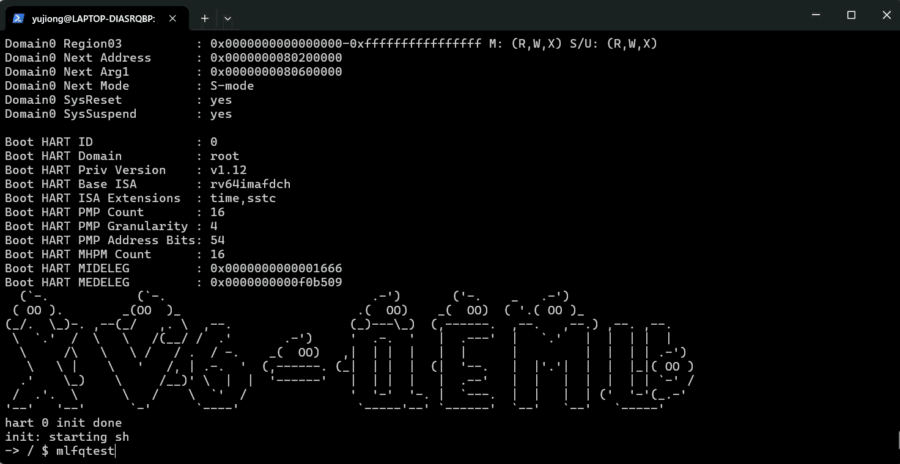

# 进程管理 - 多级反馈队列调度(MLFQ)

## 改进动机

之前搞的优先级调度虽然能区分进程重要性，但用起来还是有点别扭。最大的问题是优先级是静态的，用户得自己手动设置，太麻烦了。而且系统也不知道哪些任务是I/O密集型，哪些是CPU密集型，最后可能导致交互式任务响应慢，长任务又一直霸占CPU。

所以我决定实现MLFQ（多级反馈队列）。这个算法的核心思想就是让系统自动适应任务类型：新来的进程从最高队列开始，如果是短任务很快就跑完了；如果是CPU密集型长任务，就会慢慢降级到低队列。这样就不用手动设置优先级了，系统自己会搞定。

## 实现思路

改动主要分几块。首先要在proc结构体里加几个字段：queue_level记录当前在哪个队列（0最高，2最低），time_slice记录还剩多少时间片，ticks_used用来统计总共用了多少tick（这个主要是为了调试）。

队列配置这块有点纠结。到底用几个队列？每个队列的时间片设置多少？最后决定用3级队列，时间片分别是1、2、4。这个配置算是平衡了实现复杂度和调度效果。队列太多代码会变复杂，太少又体现不出MLFQ的优势。时间片递增的设计也挺好理解的：高优先级队列时间片小，响应快；低优先级队列时间片大，减少上下文切换开销，提高吞吐量。

新进程初始化时queue_level设为0，time_slice设为0。这里有个坑，一开始我把time_slice初始化为1（MFQ_TIME_SLICE_0），结果发现后面时间片管理逻辑变得很混乱。后来改成初始化为0，让调度器在第一次调度进程时才设置时间片，这样逻辑就清晰多了。

## 调度器的改造

调度器改动挺大的，基本上是重写了。原来的调度器就是简单找个RUNNABLE的进程就跑，现在要改成多级队列调度。

核心思想就是从队列0到队列2依次扫描，找到第一个有RUNNABLE进程的队列，就跑那个队列里的进程。同一队列内是FIFO，先找到的先跑。这样就保证了高优先级队列总是优先于低优先级队列。

有个细节要注意，在进程被选中的时候要检查time_slice。如果小于等于0，就根据queue_level重置成对应的时间片。这个重置时机很重要，一开始我搞错了时间片重置的位置，导致时间片管理一团糟。后来想明白了，时间片重置应该在进程开始运行的时候做，而不是在时间片用完的时候做。这个等下再说。

## 时间片管理的坑

这个部分是我花时间最多的，也是踩坑最多的地方。

一开始的实现思路是：每次时钟中断调用handle_time_slice()，把time_slice减1。如果减到0了，就把queue_level加1（降级），然后同时把time_slice重置为新队列的时间片值，最后返回1让调度器yield。

想法很美好，但是这样做了之后发现时间片根本没有递减，进程一直停在队列0不动。

调试了半天，才发现问题出在时间片重置的时机上。假设进程在队列1，时间片是2。第一次时钟中断，time_slice从2减到1，不触发yield。第二次时钟中断，time_slice从1减到0，触发降级，queue_level变成2，然后time_slice被重置为4（队列2的时间片），接着返回1触发yield。

但是这里有个问题！yield只是把当前进程标记为RUNNABLE，并不会立即切换到其他进程。所以yield之后，进程还是继续跑了一小段时间，然后才被调度出去。等下次调度器重新调度这个进程时，发现time_slice是4，不是0，就不会重置了。结果就是进程虽然已经降级到队列2，但时间片却一直是4，看起来像根本没递减一样。

后来换了个思路：handle_time_slice()只负责递减time_slice和降级，不负责重置time_slice。当time_slice减到0时，把它设为0（标记一下），然后queue_level加1，返回1触发yield。时间片的重置完全交给调度器去做。调度器在选中一个进程时，检查time_slice是否<=0，如果是就根据queue_level重置。

这样改了之后就好了。调度器每次选中进程都会检查并重置time_slice，handle_time_slice()只管递减和降级，职责分得很清楚。

不过这里还有个小细节。allocproc()里新进程的time_slice要初始化为0，不能初始化为1。如果初始化为1，新进程第一次被调度时time_slice是1，调度器不会重置它。等第一次时钟中断来了，time_slice从1减到0，触发降级到队列1，然后time_slice被设为0。下次调度器调度这个进程时，发现time_slice是0，才会根据queue_level（现在是1）重置为2。这样一来，新进程刚创建就降级了，根本没在队列0跑过，这显然不对。

所以新进程的time_slice必须初始化为0。这样调度器第一次选中它时就会重置time_slice为1（队列0的时间片），然后它才能在队列0正常跑。

## 抢占机制

抢占这块倒是不复杂。每次时钟中断时调用handle_time_slice()和higher_priority_ready()，如果任何一个返回1就yield。

higher_priority_ready()的检查逻辑也很简单：遍历所有进程，看看有没有进程的queue_level小于当前进程的queue_level并且状态是RUNNABLE。如果有就返回1，表示有更高队列的进程在等待运行。

这里要注意的是不要把自己也算进去。一开始我忘了加这个判断，结果进程每次时钟中断都会发现自己在队列里，然后就一直yield，死循环了。

## 测试结果分析

**结果分析：**

从测试结果可以看出，MLFQ 调度功能整体运行正常，核心机制已经按设计生效。在测试 1 中，CPU 密集型子进程从队列 0 启动，随着不断耗尽时间片逐步被降级到队列 1 和队列 2，同时对应队列的时间片长度明显增大，说明进程降级和时间片管理逻辑正确实现，且调度行为稳定、可预期。

在测试 2 的多进程竞争场景下，新创建的进程均进入最高优先级队列，进程1先被创建后执行，其执行一段时间后时间片用完被降级，进入1级队列。而进程2处于0级队列，所以可以看到进程2打断了进程1。进程2执行完后，进程1才开始继续执行。调度结果表明，调度器能够正确按照队列优先级进行选择，同时在同一队列内保持基本的公平性。

## 修改文件列表

- [kernel/include/param.h](../kernel/include/param.h) - 添加MLFQ配置常量
- [kernel/include/proc.h](../kernel/include/proc.h) - 添加MLFQ字段和函数声明
- [kernel/include/sysnum.h](../kernel/include/sysnum.h) - 添加系统调用号
- [kernel/proc.c](../kernel/proc.c) - 修改调度器、实现时间片管理
- [kernel/syscall.c](../kernel/syscall.c) - 注册新系统调用
- [kernel/sysproc.c](../kernel/sysproc.c) - 实现新系统调用
- [kernel/trap.c](../kernel/trap.c) - 修改时钟中断处理
- [xv6-user/user.h](../xv6-user/user.h) - 添加系统调用声明
- [xv6-user/usys.pl](../xv6-user/usys.pl) - 添加系统调用入口
- [xv6-user/mlfqtest.c](../xv6-user/mlfqtest.c) - MLFQ测试程序
- [Makefile](../Makefile) - 添加mlfqtest到UPROGS列表
- [docs/进程管理-多级反馈队列.md](进程管理-多级反馈队列.md) - 本文档
